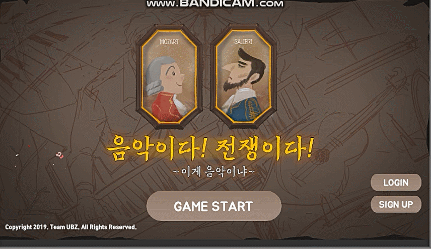
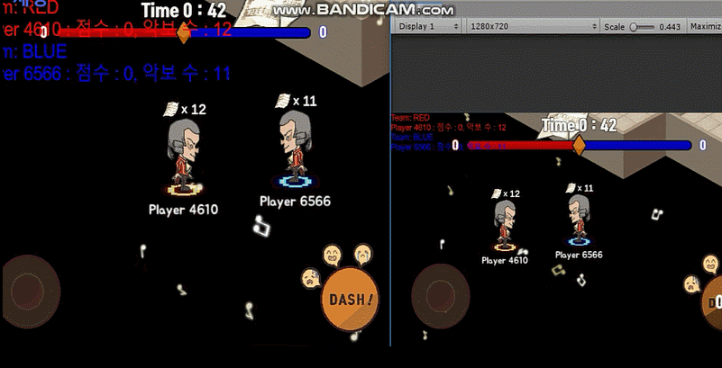

🎼 음악이다! 전쟁이다!
==
>- "음악이다! 전쟁이다!"는 Unity와 포톤 서버로 제작된 모바일 2:2 멀티 게임 입니다.
>- Bridge 동아리 게임 개발 프로젝트(19.03 ~ 19.06)

## 🤝🏻 팀 UBZ
>- 팀 언바지(UBZ)는 게임 개발 연합 동아리 Bridge에서 모여 총 7명으로 구성 되어 있습니다.
>- 팀 구성 : 기획자 1명, 프로그래머 3명, 아트 2명, 사운드 1명

## :pencil: 개발 내용 및 역할

- 포톤 서버를 활용하여 멀티 플레이 구현
  > 이동, 대시 공격, 이모티콘, 아이템 습득, 상태 이상, 악보 획득 및 약탈, 약보 팀 베이스존 골인 동기화 
  > 게임 승리 규칙 구현 - 제한 시간 내에 악보를 많이 획득한 팀 승리

- 인게임 UI 및 아웃게임 콘텐츠 개발
  > 타이틀 화면, 가상 조이스틱, 대시 키, 이모티콘, 팀 점수 UI

## :art: 게임 이미지  

